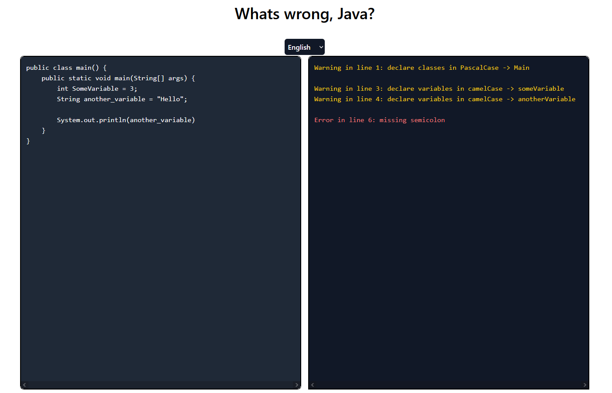

# whatswrong



## about

This is a (currently only) Java linter embedded in the browser.
The goal of the linter is to tell Java-beginners more about the errors they make than the IDE linters tell them.

This means the linter **is not** capable of detecting complex issues, but more general ones.

## building

```sh
$ npm run build
```
